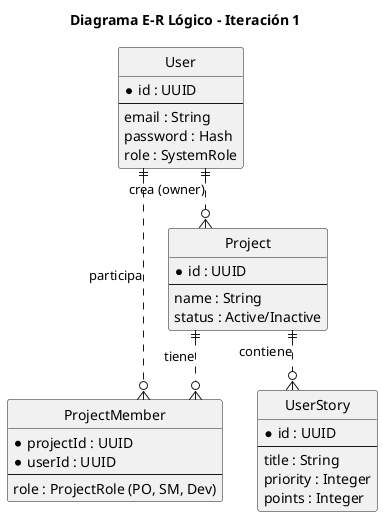
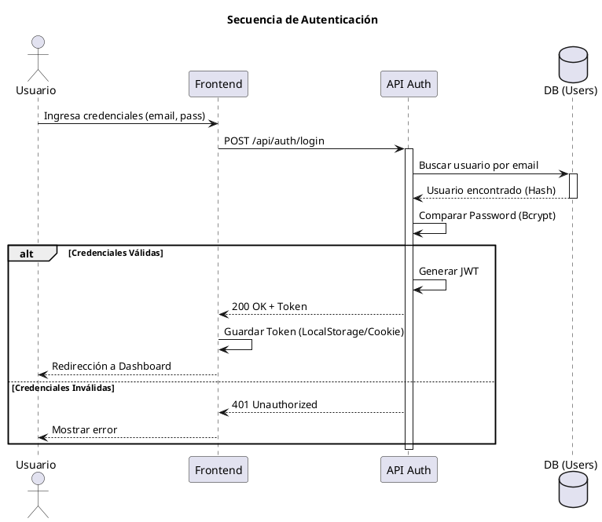
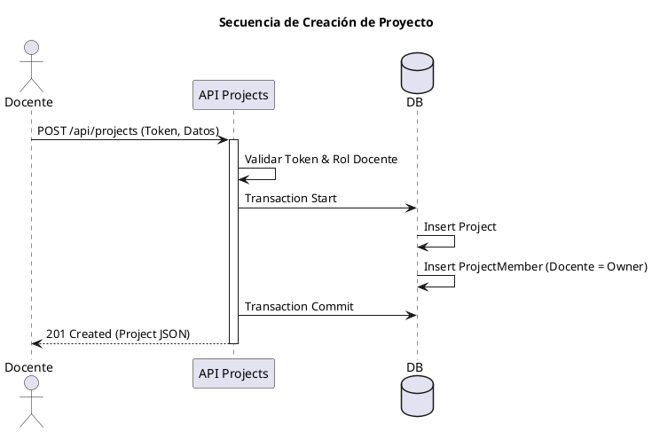

# Documentación de la Iteración 1: Gestión de Identidad y Alcance (HU-01, HU-02, HU-03)

## 1. Planificación
En esta fase se establecen los cimientos del proyecto "WorkflowS", definiendo las herramientas, el entorno y el alcance inicial centrado en la gestión de usuarios y proyectos.

### Tareas Técnicas (Scrum + XP)

#### 1.1 Configuración del entorno de desarrollo y repositorio (Git)
*   **Acción**: Se inicializó el repositorio con la estructura estándar para un monorepo o proyecto modular.
*   **Herramientas**: Node.js, TypeScript, Git.
*   **Configuración**:
    *   `.gitignore` configurado para excluir `node_modules`, `.env`, y directorios de build.
    *   Instalación de linter (Biome/ESLint) y formateador para asegurar calidad de código desde el día 0.
    *   Definición de ramas principales: `main` (producción), `develop` (integración).

#### 1.2 Definición y estimación de HU-01, HU-02, HU-03
*   **HU-01 (Gestionar usuarios)**: Estimada en 5 Story Points. Complejidad media debido a la seguridad (hashing, JWT).
*   **HU-02 (Crear proyectos)**: Estimada en 3 Story Points. CRUD estándar con relaciones.
*   **HU-03 (Priorizar historias)**: Estimada en 5 Story Points. Requiere lógica de ordenamiento y estructuras de datos para el backlog.

#### 1.3 Configuración del motor de Base de Datos y ORM
*   **Selección**: SQLite para desarrollo local (rápido, sin dependencias externas) y Prisma ORM para el manejo de esquemas y migraciones.
*   **Acción**: Inicialización de `schema.prisma` y primera migración base.

### Entregables de Planificación
*   [x] **Stack Tecnológico Configurado**: Repositorio activo con `package.json` y scripts de inicio.
*   [x] **Backlog de la Iteración**: Lista priorizada de las 3 Historias de Usuario listas para desarrollo.

---

## 2. Diseño
El diseño se enfoca en modelar la persistencia de datos y los flujos de interacción críticos antes de escribir código.

### Tareas Técnicas (Scrum + XP)

#### 2.1 Modelado E-R (Entidad-Relación)
Se definieron las entidades núcleo para soportar la identidad y la estructura de proyectos.

*   **Usuario**: Credenciales, Roles (Docente, Estudiante).
*   **Proyecto**: Metadatos, Fechas, Dueño.
*   **Rol/Miembro**: Tabla intermedia para asignar roles específicos por proyecto.
*   **Historia de Usuario**: Unidad de trabajo asociada a un proyecto.



#### 2.2 Diagramas de Secuencia
Se diseñaron los flujos críticos para asegurar la comprensión de la lógica de negocio.

**Diagrama de Secuencia: Autenticación (Login)**
*Nota: Flujo seguro para obtención de Token JWT.*



**Diagrama de Secuencia: Creación de Proyecto**
*Nota: Validación de roles y asignación automática del creador.*



#### 2.3 Prototipado de Alta Fidelidad (UI)
Se diseñaron las interfaces para asegurar una experiencia de usuario fluida desde el inicio.

*   **Login**: Formulario centrado, validación en tiempo real.
*   **Dashboard Admin**: Tabla de proyectos con acciones rápidas (Editar, Borrar).

### Entregables de Diseño
*   [x] **Esquema de Base de Datos (v1)**: Archivo `schema.prisma` validado.
*   [x] **Mockups**: Diseños aprobados para implementación.

---

## 3. Codificación
Implementación siguiendo TDD (Test Driven Development) donde sea posible y estándares de código limpio.

### Tareas Técnicas (Scrum + XP)

#### 3.1 Implementación de API REST
Desarrollo de endpoints modulares utilizando Express/Node.js.

*   **Auth**: `POST /login`, `POST /register`. Implementación de JWT con expiración.
*   **Users**: `GET /me` (Perfil), `PUT /update`.
*   **Projects**: `POST /` (Crear), `GET /` (Listar mis proyectos).
*   **Stories**: `POST /:projectId/stories` (Añadir al backlog).

*Ejemplo de Controlador de Proyecto (Simplificado):*
```typescript
// src/server/routes/projects.ts
export const createProject = async (req, res) => {
  // Validación de entrada
  if (!req.body.name) return res.status(400).send("Nombre requerido");
  
  // Transacción para consistencia
  const project = await prisma.$transaction(async (tx) => {
    const p = await tx.project.create({ data: { ...req.body, ownerId: req.user.id } });
    await tx.projectMember.create({ data: { projectId: p.id, userId: req.user.id, role: 'OWNER' } });
    return p;
  });
  
  return res.status(201).json(project);
};
```

#### 3.2 Desarrollo Frontend
Construcción de la SPA (Single Page Application) con React.

*   **Vistas**:
    *   `LoginPage.tsx`: Manejo de estado de formulario y errores.
    *   `Dashboard.tsx`: Grid responsivo de tarjetas de proyecto.
    *   `BacklogView.tsx`: Lista inicial de historias.
*   **Integración**: Uso de `fetch` o `axios` interceptors para inyectar el Token JWT automáticamente.

#### 3.3 Refactorización Preliminar
Aplicación de principios DRY (Don't Repeat Yourself).
*   Extracción de componentes UI base: `Button`, `Input`, `Card`.
*   Creación de Hooks personalizados: `useAuth()` para manejar la sesión en cualquier componente.

### Entregables de Codificación
*   [x] **Módulo de Seguridad y Usuarios**: Funcional y seguro.
*   [x] **Módulo de Gestión de Proyectos y Backlog**: Permite el flujo básico de trabajo.

---

## 4. Pruebas
Aseguramiento de la calidad mediante pruebas automatizadas y manuales.

### Tareas Técnicas (Scrum + XP)

#### 4.1 Pruebas Unitarias (Jest/Vitest)
Foco en la lógica de negocio pura y utilidades.
*   **Seguridad**: Validar que las contraseñas nunca se guarden en texto plano.
*   **Roles**: Validar que un usuario 'Estudiante' no tenga permisos de 'Admin'.

#### 4.2 Pruebas de Integración
Validación de la comunicación entre API y Base de Datos.
*   **Flujo**: Crear Proyecto -> Verificar que aparece en la lista del usuario -> Verificar que el usuario es miembro.

#### 4.3 Pruebas de Aceptación (Simulado)
Validación contra los Criterios de Aceptación de las HU.
*   *Verificación HU-01*: El sistema rechaza correos inválidos.
*   *Verificación HU-03*: Las historias se guardan con la prioridad correcta.

### Entregables de Pruebas
*   [x] **Reporte de Cobertura**: Objetivo > 80% en lógica de negocio crítica.
*   [x] **Suite de Pruebas**: Ejecutable mediante `npm test`.
